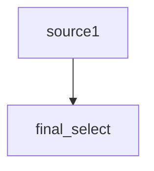

# sqlmermaid

sqlmermaid parses dependency structure inside an SQL query into mermaid syntax.

## Usage

1. Install [Poetry](https://python-poetry.org/docs/#installing-with-the-official-installer)
2. Install dependencies

```bash
poetry install
```

3. Use `--query` to input query to be parsed

```bash
poetry run sqlmermaid --query "select * from source1"
```

The result would look like this,

````

````

## Testing

sqlmermaid uses a suite of testing tools whose configs are presented on `pyproject.toml`, such as

- Static type checker: `poetry run pyright`
- Linter: `poetry run ruff check`
- Formatter: `poetry run ruff format`
- Unit tests:
  - Execute: `poetry run coverage run`
  - Print report: `poetry run coverage report`
